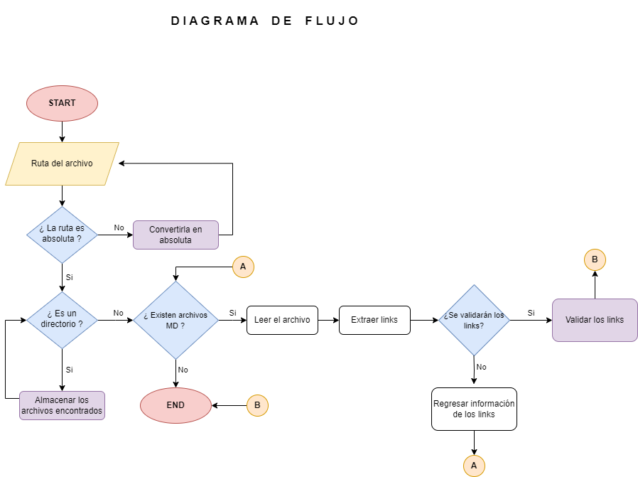

# MDLinks - Markdown Links

## Índice

* [1. Preámbulo](#1-preámbulo)
* [2. Resumen del proyecto](#2-resumen-del-proyecto)
* [3. Diagrama de Flujo](#3-diagrama-de-flujo)
* [4. Tutorial](#4-tutorial)

***

## 1. Preámbulo

Markdown - Es un lenguaje de marcado ligero muy popular entre developers. Es usado en muchísimas plataformas que manejan texto plano (GitHub, foros, blogs, ...) y es muy común encontrar varios archivos en ese formato en cualquier tipo de repositorio.

Estos archivos `Markdown` normalmente contienen _links_ (vínculos/ligas) que muchas veces están rotos o ya no son válidos y eso perjudica mucho el valor de la información que se quiere compartir.

## 2. Resumen del proyecto

Dentro de una comunidad de código abierto, es importante crear una herramienta usando [Node.js], que lea y analice archivos en formato `Markdown`, para verificar los links que contengan y decir si son válidos o no. Este proyecto MDLinks se trata de eso.

## 3. Diagrama de Flujo

## 4. Tutorial

* Se lee una ruta.

* Se revisa si existe o no.

* Se determina si es relativa o absoluta. En caso de ser relativa, se convierte a aboluta.

* Se analiza si es archivo o directorio.

* En caso de ser archivo, verifica si es markdown (.md).

* Se lee el archivo y se extraen los links encontrados.

* Si el usuario desea validarlos, se validan. Los que son válidos manejan el estatus de OK y los que no, un código de error.

* En caso de ser directorio, revisa de manera recursiva si dentro existen archivos markdown.

* Lee cada uno de ellos y realiza la función de archivo que vimos anteriormente, la diferencia es que agrupa los links que están dentro de los archivos .md encontrados en un sólo arreglo.

* Termina la extracción o validación, según sea la elección del usuario.

